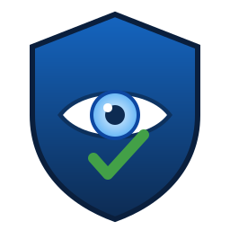
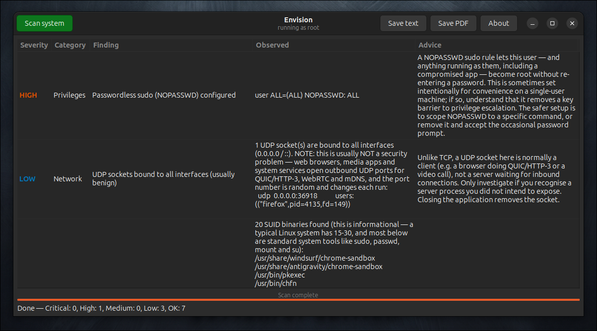

# Envision

<p align="center">
  
</p>

<p align="center">
  <strong>See your system the way an attacker would — then fix it.</strong><br>
  A GTK4 desktop security‑posture scanner for Linux that audits your machine
  and produces an actionable hardening report with copy‑paste fix commands.
</p>

<p align="center">
  
  
  
  
  
  
  
</p>

---

## Screenshot

<p align="center">
  
</p>

## What it does

Envision runs the kind of checks a security engineer performs during a manual
review of a Linux box, summarizes the findings by severity, and tells you
**exactly what to type to fix each one**. The whole report can be exported to a
polished PDF.

Each finding carries:

- a **severity** (`OK`, `LOW`, `MEDIUM`, `HIGH`, `CRITICAL`),
- a **category** (Network, SSH, Accounts, Kernel, …),
- **what was observed** on *your* system,
- **advice** explaining why it matters, and
- a **copy‑paste fix command** where one applies.

> Envision reports good news too. A check that passes is shown as `OK`, so the
> report doubles as evidence of what is already configured correctly.

## Checks performed

| Category | What is inspected |
| --- | --- |
| **Updates** | Pending package upgrades (highlighting security updates); whether `unattended-upgrades` is installed |
| **Firewall** | `ufw` / `firewalld` presence and active state; default‑deny posture |
| **Network** | Every listening socket via `ss`; **flags any service bound to `0.0.0.0` / `::`** (publicly reachable) vs. localhost‑only |
| **SSH** | `PermitRootLogin`, `PasswordAuthentication` and other `sshd` settings |
| **Privileges** | Passwordless `sudo` (`NOPASSWD`) rules |
| **Accounts** | Duplicate UID‑0 (root‑equivalent) accounts; empty‑password accounts in `/etc/shadow` |
| **Filesystem** | World‑writable files in system directories; full SUID‑binary inventory |
| **Kernel** | Hardening sysctls — ASLR, `rp_filter`, `tcp_syncookies`, `accept_redirects`, `kptr_restrict`, SUID core dumps |
| **Storage** | Disk encryption (LUKS/dm‑crypt) presence |
| **Services** | Failed `systemd` units |

The check set is intentionally extensible — new checks are a single function in
`src/scan.cpp`. Even on a clean system, Envision keeps checking for the *bad*
cases (e.g. a process that later opens a public port), so re‑scans stay
meaningful.

## Example finding (text form)

```
[LOW] (Network) UDP sockets bound to all interfaces (usually benign)
    Observed: 1 UDP socket(s) are bound to all interfaces (0.0.0.0 / ::).
              NOTE: this is usually NOT a security problem — browsers and media
              apps open outbound UDP ports for QUIC/HTTP-3, WebRTC and mDNS...
        udp  0.0.0.0:48004   users:(("firefox",pid=4135,fd=137))
    Advice  : Unlike TCP, a UDP socket here is normally a client, not a server
              waiting for inbound connections. Closing the app removes it.
```

Envision deliberately distinguishes **TCP listeners** (real exposed services —
flagged HIGH, or MEDIUM if a firewall is active) from **UDP sockets** (almost
always benign client traffic — flagged LOW with an explanation), so you are not
alarmed by, say, your browser doing QUIC.

---

## Prerequisites

### Runtime / build dependencies

**Debian / Ubuntu:**

```bash
sudo apt-get update
sudo apt-get install -y build-essential pkg-config libgtk-4-dev \
    policykit-1 iproute2 librsvg2-bin
# For PDF export:
sudo apt-get install -y texlive-latex-base texlive-latex-extra
```

**Fedora / RHEL:**

```bash
sudo dnf install -y gcc-c++ make pkgconf-pkg-config gtk4-devel polkit \
    iproute librsvg2-tools
sudo dnf install -y texlive-scheme-basic texlive-tcolorbox texlive-geometry
```

**Arch:**

```bash
sudo pacman -S --needed base-devel gtk4 polkit iproute2 librsvg \
    texlive-basic texlive-latexextra
```

| Dependency | Why |
| --- | --- |
| `gtk4` | the graphical interface |
| `polkit` / `pkexec` | privilege elevation to run as root |
| `iproute2` (`ss`) | listening‑socket enumeration |
| `pdflatex` (texlive) | PDF report export (uses `tcolorbox`, `geometry`, `xcolor`) |
| `rsvg-convert` *or* `inkscape` *or* `convert` | rasterizing the SVG icon at install time (optional — the SVG is installed regardless) |

## Build

```bash
git clone <your-fork-url> envision
cd envision
make
```

This produces the `envision` binary in the project root. You can run the GUI
directly during development:

```bash
make run           # launches the GTK interface (limited results unless root)
```

## Install

```bash
sudo make install
```

This installs:

- the `envision` binary and the `envision-launcher` wrapper to `/usr/bin`,
- `envision.desktop` to the application menu (**Categories: System / Security**),
- the polkit policy `org.jflc.Envision.policy` so `pkexec` can elevate it,
- icons into the `hicolor` theme at every size (16–256 px) **plus** the
  scalable SVG, so the icon appears in the **application menu and the window /
  taskbar**,
- and refreshes the icon and desktop databases.

To remove everything:

```bash
sudo make uninstall
```

`PREFIX` and `DESTDIR` are honoured for packaging, e.g.
`make install DESTDIR=/tmp/stage PREFIX=/usr`.

## Usage

### Graphical (recommended)

Open **Envision** from your application menu. polkit will prompt for
authentication; the app then runs as root so every check has full visibility.

In the window:

1. Click **Scan system**. A progress bar shows each check as it runs.
2. Review the findings table, sorted most‑severe first, with colour‑coded
   severities.
3. Click **Save PDF** to render a formatted report with `pdflatex`, or
   **Save text** for a plain‑text copy.
4. **About** lists the author and full feature set.

You can also launch from a terminal:

```bash
envision-launcher      # elevates via pkexec, preserving your display
```

### Headless / scripting

```bash
sudo envision --cli                 # print the text report to stdout
sudo envision --cli report.pdf      # also write a PDF
envision --help
```

Running without root still works but some checks (e.g. `/etc/shadow`, a full
filesystem SUID sweep) are limited; the GUI shows a banner when this is the
case.

## How elevation works

Desktop GUIs can't simply be `pkexec`'d, because `pkexec` scrubs the
environment and the GTK app would lose access to your display. Envision ships
`envision-launcher`, which authorizes the root process for your X/Wayland
session and forwards `DISPLAY`, `XAUTHORITY`, `WAYLAND_DISPLAY` and
`XDG_RUNTIME_DIR` through `pkexec`. The `.desktop` entry uses this launcher.

## Project layout

```
envision/
├── src/
│   ├── scan.hpp      # data model (Finding, ScanReport, Severity)
│   ├── scan.cpp      # the scan engine and every individual check
│   ├── report.cpp    # text + LaTeX rendering and pdflatex invocation
│   └── main.cpp      # GTK4 UI (GtkApplication), threaded scan, CLI mode, About dialog
├── icons/envision.svg
├── desktop/envision.desktop
├── desktop/envision-launcher
├── polkit/org.jflc.Envision.policy
├── Makefile
└── README.md
```

## Extending

Add a new check by writing a `static void check_xxx(ScanReport *r)` function in
`src/scan.cpp` that calls `add_finding(...)`, then add it to the `checks[]` array
in `scan_run()`. It will automatically appear in the UI, the text report and
the PDF. Future ideas: AppArmor/SELinux enforcement, listening‑port → process
reputation, password‑policy (`pam`) audit, mount options (`nodev`/`nosuid`),
auditd status, and rootkit scanners.

## Security & privacy

- Envision only **reads** system state — it never changes your configuration.
  Fixes are presented as commands for *you* to review and run.
- Reports are written only where you choose to save them. Temporary LaTeX files
  are created under a private `mkdtemp` directory and removed afterward.

## Author

**Jean‑Francois Lachance‑Caumartin**

## License

MIT.
